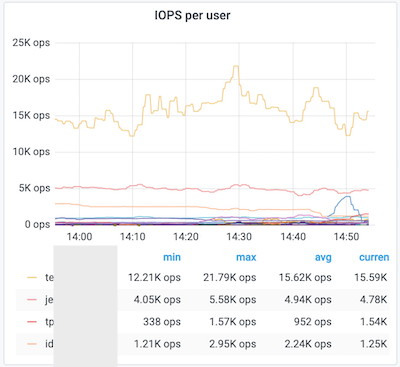
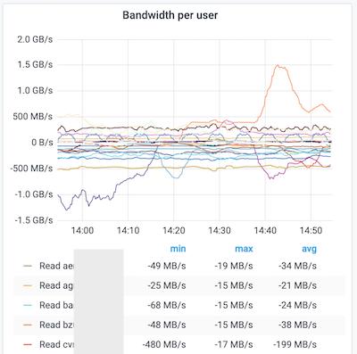
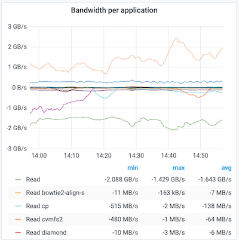

# lustre\_exporter\_slurm

This script is intended to be used with [Lustre jobstats](http://doc.lustre.org/lustre_manual.xhtml#dbdoclet.jobstats) and [lustre_exporter](https://github.com/HewlettPackard/lustre_exporter). The REST requests from prometheus to lustre\_exporter will be modified by this script to add user and account labels instead of only `$SLURM_JOB_ID`.

Metrics from nodes using `procname_uid` will also be modified, the numerical UID will be extracted and converted to a username and stored in the user label. The application name is also extracted and available in the tags.

A MySQL connection to the slurmdb database is used to extract the user and account from the `$SLURM_JOB_ID`.

A connection to a ldap server is used to convert numerical uid to a username.

## Metric example
Here is an example of the modified metrics with the additional tags:

```
lustre_job_read_bytes_total{component="ost",jobid="18526388",target="lustre04-OST0007",fs="lustre04",user="user1",account="an_account"} 0
lustre_job_read_samples_total{component="ost",jobid="chmod.3021723",target="lustre04-OST0004",fs="lustre04",application="chmod",user="user2"} 0
```

This allow native request in prometheus with the new tags, like doing the sum of all the IOPS from a single user with many jobs with 1 Prometheus request.

## Graph example
Prometheus can now combined the information of multiple jobs and sum them per user. Example to get the IOPS per user:

```
topk(20, sum by (user) (rate(lustre_job_stats_total{instance=~"lustre-mds.*"}[5m])))
```


(Negative bandwidth means reading from the filesystem in this graph)




## Prometheus config
The relabel feature is used to redirect the REST call to the local lustre\_exporter\_slurm script instead of pooling directly the MDS/OSS.

```
  relabel_configs:
    - source_labels: [__address__]
      target_label: __metrics_path__
      regex: '(.*):(.*)'
      replacement: '/$1'
    - source_labels: [__address__]
      target_label: instance
    - source_labels: [__address__]
      regex: '(.*):(.*)'
      replacement: '127.0.0.1:8080'
      target_label: __address__
```

A manual test can be done before modifing prometheus config:

```
curl 127.0.0.1:8080/lustre04-oss1
```

The output of this curl should have the new tags, this is what Prometheus will index.

This script is using the hostname specified at the end of the previous url to launch a HTTP request to the lustre server on port 9169, where lustre_exporter is running.

## lustre\_exporter\_slurm config
An example of the expected config is available in `config.ini.dist`. For the MySQL user in the slurmdb, this can be a read-only user with access only to the job_table table.